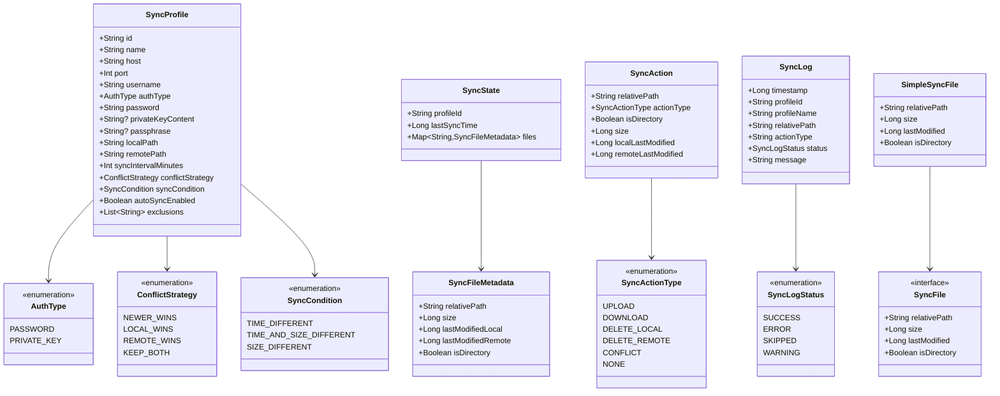
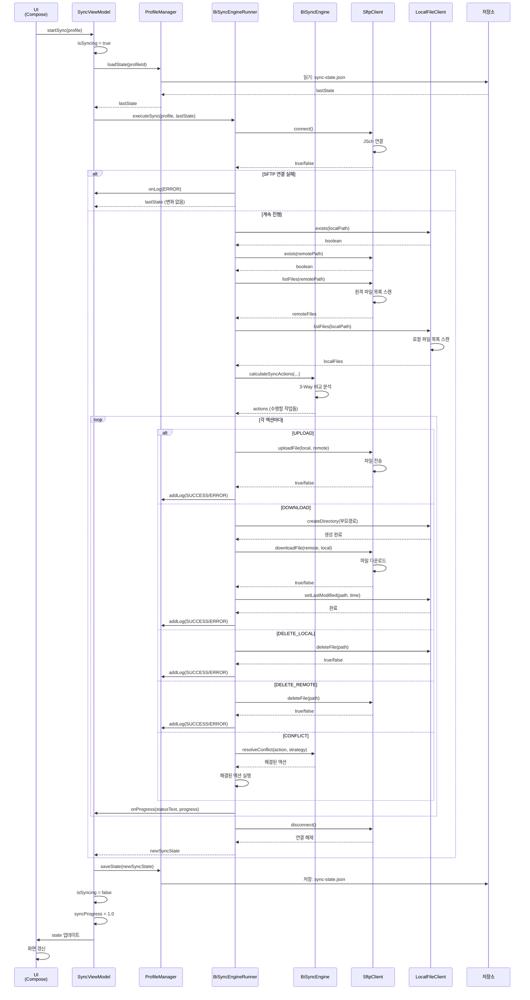
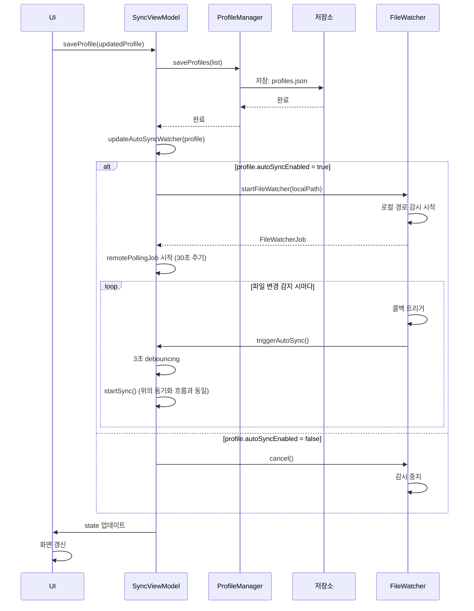
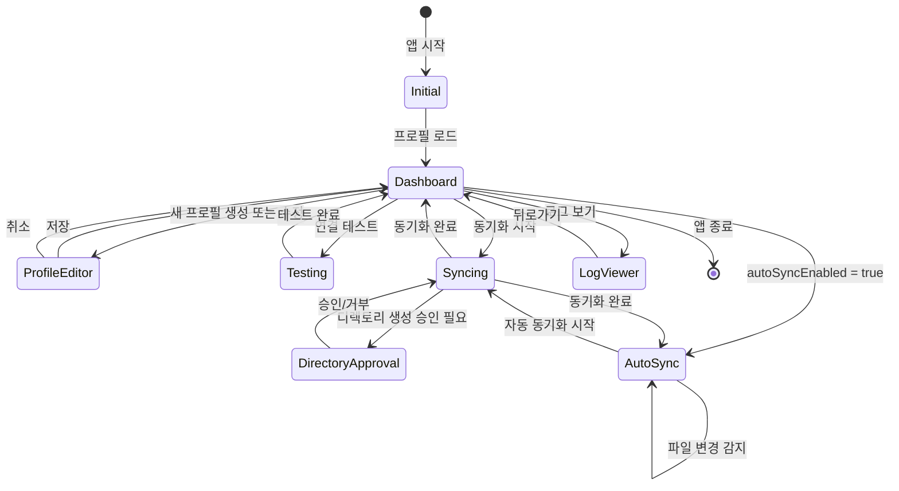
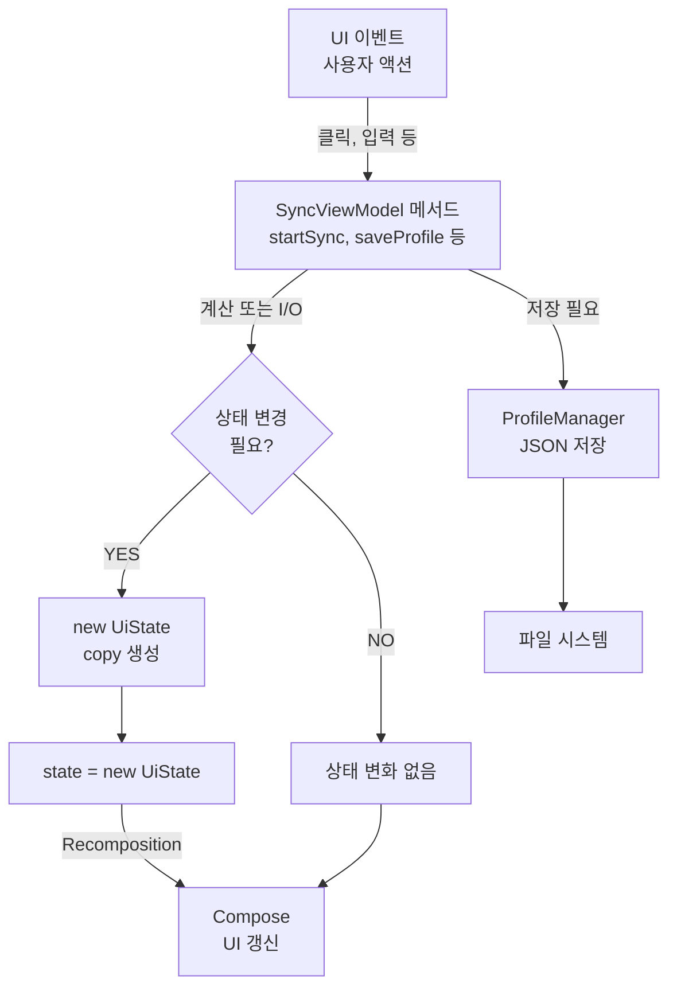

# 🏗️ SFTP BiSync - 전체 아키텍처 및 코드 설명 문서

## 📋 목차
1. [프로젝트 개요](#프로젝트-개요)
2. [시스템 아키텍처](#시스템-아키텍처)
3. [데이터 모델 (UML)](#데이터-모델-uml)
4. [주요 컴포넌트](#주요-컴포넌트)
5. [동기화 엔진 상세 분석](#동기화-엔진-상세-분석)
6. [실행 흐름 (시퀀스 다이어그램)](#실행-흐름-시퀀스-다이어그램)
7. [충돌 해결 메커니즘](#충돌-해결-메커니즘)
8. [상태 관리](#상태-관리)

---

## 프로젝트 개요

**SFTP BiSync**는 **Kotlin Multiplatform (KMP)** 및 **Compose Multiplatform**을 기반으로 개발된 스마트한 양방향(Bi-directional) SFTP 동기화 클라이언트입니다.

### 핵심 특징
- **3-Way 동기화 알고리즘**: 마지막 동기화 상태 스냅샷을 기반으로 정확한 변경사항 감지
- **지능형 충돌 해결**: 4가지 전략 (NEWER_WINS, LOCAL_WINS, REMOTE_WINS, KEEP_BOTH)
- **멀티플랫폼 지원**: Android, Linux, Windows, macOS
- **자동 동기화**: 파일 변경 감지 및 원격 서버 폴링
- **강화된 보안**: 자격증명 암호화, SSH 기반 전송

---

## 시스템 아키텍처

### 전체 시스템 구조

```mermaid
graph TB
    subgraph Platform["플랫폼 레이어"]
        Android["📱 Android"]
        Desktop["🖥️ Desktop<br/>Linux/Windows/macOS"]
    end
    
    subgraph Compose["UI 레이어<br/>Compose Multiplatform"]
        App["App.kt"]
        UI["UI 컴포넌트"]
    end
    
    subgraph ViewModel["상태 관리 레이어"]
        VM["SyncViewModel"]
        UiState["UiState"]
    end
    
    subgraph Business["비즈니스 로직 레이어"]
        Engine["BiSyncEngine<br/>동기화 엔진"]
        Runner["BiSyncEngineRunner<br/>실행 엔진"]
        PM["ProfileManager<br/>프로필 관리"]
    end
    
    subgraph Bridge["인터페이스/브릿지 레이어"]
        SftpClient["SftpClient<br/>SFTP 추상화"]
        LocalClient["LocalFileClient<br/>로컬 파일 추상화"]
    end
    
    subgraph Implementation["구현 레이어"]
        JschSftp["JschSftpClient"]
        JavaLocal["JavaLocalFileClient"]
        AndroidLocal["AndroidLocalFileClient"]
        Service["SyncForegroundService<br/>Android 백그라운드"]
    end
    
    subgraph Storage["저장소 레이어"]
        Profiles["프로필<br/>JSON"]
        States["동기화 상태<br/>JSON"]
        Logs["동기화 로그<br/>JSON"]
    end
    
    Platform --> Compose
    Compose --> ViewModel
    ViewModel --> Business
    Business --> Bridge
    Bridge --> Implementation
    Implementation --> Storage
    
    style Engine fill:#6366f1,color:#fff
    style Runner fill:#6366f1,color:#fff
    style VM fill:#8b5cf6,color:#fff
```



---

## 데이터 모델 (UML)

### 클래스 다이어그램



### 데이터 모델 설명

#### 1. **SyncProfile** (동기화 프로필)
동기화 작업의 모든 설정을 정의합니다.

| 필드 | 설명 |
|------|------|
| `id` | 프로필 고유 ID (UUID) |
| `name` | 사용자가 지정한 프로필 이름 |
| `host`, `port`, `username` | SFTP 서버 연결 정보 |
| `authType` | 인증 방식 (비밀번호 또는 개인키) |
| `password`, `privateKeyContent` | 인증 자격증명 |
| `localPath`, `remotePath` | 동기화할 로컬/원격 디렉토리 |
| `syncIntervalMinutes` | 자동 동기화 간격 (0 = 수동) |
| `conflictStrategy` | 충돌 발생 시 해결 방식 |
| `syncCondition` | 변경 감지 기준 (타임스탬프/크기) |
| `exclusions` | 제외할 파일/디렉토리 목록 |

#### 2. **SyncState** (동기화 상태 스냅샷)
마지막 동기화 시점의 파일 상태를 기록합니다. **3-Way 동기화의 핵심**입니다.

| 필드 | 설명 |
|------|------|
| `profileId` | 이 상태가 속한 프로필 ID |
| `lastSyncTime` | 마지막 동기화 시간 |
| `files` | 각 파일의 메타데이터 맵 |

#### 3. **SyncFileMetadata** (파일 메타데이터)
동기화 상태 저장용 파일 정보입니다.

| 필드 | 설명 |
|------|------|
| `relativePath` | 프로필 루트 기준 상대 경로 |
| `size` | 파일 크기 (바이트) |
| `lastModifiedLocal` | 로컬 마지막 수정 시간 |
| `lastModifiedRemote` | 원격 마지막 수정 시간 |
| `isDirectory` | 디렉토리 여부 |

#### 4. **SyncAction** (수행할 액션)
계산된 동기화 작업을 나타냅니다.

| 필드 | 설명 |
|------|------|
| `actionType` | UPLOAD / DOWNLOAD / DELETE_LOCAL / DELETE_REMOTE / CONFLICT / NONE |
| `relativePath` | 대상 파일의 상대 경로 |
| `isDirectory` | 디렉토리 여부 |
| `size` | 파일 크기 |
| `localLastModified`, `remoteLastModified` | 수정 시간 |

#### 5. **SyncLog** (동기화 로그)
모든 동기화 작업 결과를 기록합니다.

| 필드 | 설명 |
|------|------|
| `timestamp` | 작업 시간 |
| `profileId`, `profileName` | 프로필 정보 |
| `status` | SUCCESS / ERROR / SKIPPED / WARNING |
| `message` | 작업 결과 메시지 |

---

## 주요 컴포넌트

### 1. BiSyncEngine (핵심 동기화 엔진)

**위치**: `composeApp/src/commonMain/kotlin/com/sftpsync/app/sync/BiSyncEngine.kt`

이 클래스는 **3-Way 동기화 알고리즘의 핵심**을 구현합니다.

#### 주요 메서드

##### a) `calculateSyncActions()`
현재 상태(로컬, 원격)와 마지막 스냅샷을 비교하여 수행할 액션 목록을 계산합니다.

**입력**:
- `localFiles`: 현재 로컬 파일 목록
- `remoteFiles`: 현재 원격 파일 목록
- `lastState`: 마지막 동기화 상태
- `exclusions`: 제외할 파일 목록
- `syncCondition`: 변경 감지 기준

**로직** (7가지 경우의 수):

```
1. Local ≠ null, Remote ≠ null, Meta ≠ null (모두 존재)
   ├─ LocalChanged && RemoteChanged → CONFLICT
   ├─ LocalChanged && !RemoteChanged → UPLOAD
   ├─ !LocalChanged && RemoteChanged → DOWNLOAD
   └─ !LocalChanged && !RemoteChanged → NONE

2. Local ≠ null, Remote ≠ null, Meta = null (로컬/원격 모두 새로 추가)
   ├─ Identical (시간/크기 같음) → NONE
   └─ Different → CONFLICT

3. Local ≠ null, Remote = null, Meta ≠ null (원격에서 삭제됨)
   ├─ LocalChanged → CONFLICT
   └─ !LocalChanged → DELETE_LOCAL

4. Local = null, Remote ≠ null, Meta ≠ null (로컬에서 삭제됨)
   ├─ RemoteChanged → CONFLICT
   └─ !RemoteChanged → DELETE_REMOTE

5. Local ≠ null, Remote = null, Meta = null (로컬에서만 신규 추가)
   └─ UPLOAD

6. Local = null, Remote ≠ null, Meta = null (원격에서만 신규 추가)
   └─ DOWNLOAD

7. Local = null, Remote = null, Meta ≠ null (양쪽 다 삭제)
   └─ NONE (이미 삭제됨)
```

##### b) `resolveConflict()`
CONFLICT 액션을 주어진 전략에 따라 해결합니다.

```
ConflictStrategy:
├─ NEWER_WINS → 최신 수정본이 다른 쪽에 덮어씁니다
├─ LOCAL_WINS → 로컬이 항상 원격을 덮어씁니다
├─ REMOTE_WINS → 원격이 항상 로컬을 덮어씁니다
└─ KEEP_BOTH → 양쪽 모두 다른 이름으로 보존합니다
```

##### c) `isExcluded()`
파일 경로가 제외 목록에 있는지 확인합니다.

지원하는 패턴:
- 정확한 경로: `.git`, `.DS_Store`
- 포함된 경로: `/path/to/file`
- 와일드카드: `*.tmp`, `*.log`

### 2. BiSyncEngineRunner (실행 엔진)

**위치**: `composeApp/src/commonMain/kotlin/com/sftpsync/app/sync/BiSyncEngineRunner.kt`

BiSyncEngine의 계산 결과를 실제로 수행합니다.

#### 주요 메서드: `executeSync()`

**흐름**:
1. SFTP 서버 연결
2. 로컬/원격 디렉토리 확인 및 생성
3. 로컬/원격 파일 목록 수집
4. `BiSyncEngine.calculateSyncActions()` 호출
5. 각 액션 순차 실행:
   - **UPLOAD**: 로컬 → 원격
   - **DOWNLOAD**: 원격 → 로컬
   - **DELETE_LOCAL**: 로컬 삭제
   - **DELETE_REMOTE**: 원격 삭제
   - **CONFLICT**: 충돌 해결 전략 적용
6. 메타데이터 업데이트
7. 새로운 SyncState 반환

#### KEEP_BOTH 전략 상세 로직

충돌 파일을 양쪽 모두 보존할 때:

```
원본: file.txt (로컬과 원격에서 다르게 수정)
      ↓
1. 로컬 파일 이름 변경: file_local.txt
2. 원격 파일을 다운로드: file_remote.txt
3. 로컬에서 로컬 파일을 원격으로 업로드 (새 이름)
4. 원격의 원본 파일 삭제
5. 메타데이터 업데이트
```

결과:
- `file_local.txt`: 원래 로컬 버전
- `file_remote.txt`: 원래 원격 버전

### 3. SyncViewModel (상태 관리)

**위치**: `composeApp/src/commonMain/kotlin/com/sftpsync/app/ui/viewmodel/SyncViewModel.kt`

UI와 비즈니스 로직 사이의 연결고리입니다.

#### UiState 구조

```kotlin
data class UiState(
    val profiles: List<SyncProfile> = emptyList(),          // 저장된 프로필
    val selectedProfile: SyncProfile? = null,               // 현재 선택된 프로필
    val logs: List<SyncLog> = emptyList(),                  // 동기화 로그
    val isSyncing: Boolean = false,                         // 동기화 진행 중?
    val syncProgress: Float = 0f,                           // 진행도 (0.0 ~ 1.0)
    val syncStatusText: String = "",                        // 상태 메시지
    val isConnecting: Boolean = false,                      // 연결 테스트 중?
    val connectionResult: Boolean? = null,                  // 연결 테스트 결과
    val currentScreen: AppScreen = AppScreen.DASHBOARD,     // 현재 화면
    val editingProfile: SyncProfile? = null,                // 편집 중인 프로필
    val androidPermissionGranted: Boolean = true,           // Android 권한 승인
    val directoryApprovalRequest: DirectoryApprovalRequest? = null  // 디렉토리 생성 승인
)
```

#### 자동 동기화 메커니즘

```
autoSyncEnabled = true인 프로필에 대해:

1. 로컬 파일 시스템 감시 (FileWatcher)
   ├─ 파일 변경 감지
   ├─ 3초 debouncing (중복 동기화 방지)
   └─ triggerAutoSync() 호출

2. 원격 서버 폴링 (30초 주기)
   ├─ 매 30초마다 startSync() 호출
   ├─ 동기화 진행 중이면 건너뜀
   └─ 반복...

3. Android 백그라운드 서비스
   └─ SyncForegroundService: 앱이 백그라운드에서도 동기화 가능
```

#### 주요 메서드

| 메서드 | 설명 |
|--------|------|
| `loadAllData()` | 프로필과 로그 로드, 자동 동기화 시작 |
| `saveProfile()` | 프로필 저장 및 자동 감시 활성화 |
| `deleteProfile()` | 프로필 삭제 및 감시 중지 |
| `startSync()` | 즉시 동기화 시작 |
| `testConnection()` | SFTP 서버 연결 테스트 |
| `updateAutoSyncWatcher()` | 파일 감시 설정/해제 |

### 4. ProfileManager (프로필 관리)

**위치**: `composeApp/src/commonMain/kotlin/com/sftpsync/app/utils/ProfileManager.kt`

프로필, 상태, 로그를 JSON 파일로 저장/로드합니다.

```
파일 구조:
~/.sftpsync/
├─ profiles.json       (모든 프로필)
├─ sync-states/
│  ├─ profile-id-1.json (프로필1의 동기화 상태)
│  └─ profile-id-2.json (프로필2의 동기화 상태)
└─ logs/
   └─ logs.json        (모든 동기화 로그)
```

### 5. 인터페이스/브릿지 (SftpClient, LocalFileClient)

**위치**: `composeApp/src/commonMain/kotlin/com/sftpsync/app/sftp/SftpInterfaces.kt`

플랫폼별 구현을 추상화합니다.

#### SftpClient 인터페이스

```kotlin
interface SftpClient {
    fun connect(): Boolean
    fun disconnect()
    fun exists(path: String): Boolean
    fun createDirectory(path: String): Boolean
    fun listFiles(path: String): List<SyncFile>
    fun uploadFile(localPath: String, remotePath: String, progressCallback: (Long) -> Unit): Boolean
    fun downloadFile(remotePath: String, localPath: String, progressCallback: (Long) -> Unit): Boolean
    fun deleteFile(path: String): Boolean
    fun getFileLastModified(path: String): Long
}
```

#### LocalFileClient 인터페이스

```kotlin
interface LocalFileClient {
    fun exists(path: String): Boolean
    fun createDirectory(path: String): Boolean
    fun listFiles(path: String): List<SyncFile>
    fun deleteFile(path: String): Boolean
    fun setLastModified(path: String, timestamp: Long): Boolean
}
```

#### 플랫폼별 구현

| 클래스 | 플랫폼 | SFTP 라이브러리 |
|--------|--------|-----------------|
| `JschSftpClient` | 모두 | JSch (Java SFTP) |
| `JavaLocalFileClient` | Desktop | Java File API |
| `AndroidLocalFileClient` | Android | Android Storage API |

---

## 동기화 엔진 상세 분석

### 3-Way 동기화 알고리즘의 원리

3-Way 동기화는 **마지막 동기화 시점의 스냅샷**을 기반으로 정확한 변경사항을 감지합니다.

```
시간 흐름:
═══════════════════════════════════════════════

T0 (첫 동기화):
Local: [A(v1), B(v1)]    Remote: [A(v1), B(v1)]
                   ↓
         State Snapshot = {A: v1, B: v1}

───────────────────────────────────────────────

T1 (사용자가 파일 수정):
Local:  [A(v2), B(v1), C(v1)]    Remote: [A(v1), B(v2)]
                   ↓
        T0 Snapshot = {A: v1, B: v1}

───────────────────────────────────────────────

T1 동기화 시작:
파일 A 분석:
  ├─ Local: v2 (≠ Snapshot v1) → 로컬 수정됨
  ├─ Remote: v1 (= Snapshot v1) → 원격 수정 안됨
  └─ 결론: UPLOAD (로컬 → 원격)

파일 B 분석:
  ├─ Local: v1 (= Snapshot v1) → 로컬 수정 안됨
  ├─ Remote: v2 (≠ Snapshot v1) → 원격 수정됨
  └─ 결론: DOWNLOAD (원격 → 로컬)

파일 C 분석:
  ├─ Local: v1 (새로 추가) → 스냅샷에 없음
  ├─ Remote: 없음
  └─ 결론: UPLOAD (새 파일)

═══════════════════════════════════════════════
```

### 2-Way 동기화와의 차이점

**2-Way (단순 비교)**:
```
로컬 타임스탬프 vs 원격 타임스탐프
→ 더 최신 것으로 덮어쓰기
→ 문제: 오래된 파일이 의도치 않게 복구될 수 있음
```

**3-Way (스냅샷 기반)**:
```
로컬 타임스탬프 vs 스냅샷 vs 원격 타임스탐프
→ 누가 수정했는지 명확하게 파악
→ 정확한 변경사항 감지
→ 의도하지 않은 파일 복구 없음
```

### 변경 감지 조건 (SyncCondition)

```
TIME_DIFFERENT (기본값):
  ├─ 로컬: lastModified ≠ 스냅샷 → 수정됨
  └─ 원격: lastModified ≠ 스냅샷 → 수정됨

SIZE_DIFFERENT:
  ├─ 로컬: size ≠ 스냅샷 → 수정됨
  └─ 원격: size ≠ 스냅샷 → 수정됨

TIME_AND_SIZE_DIFFERENT:
  ├─ 로컬: (lastModified ≠ 스냅샷) AND (size ≠ 스냅샷) → 수정됨
  └─ 원격: (lastModified ≠ 스냅샷) AND (size ≠ 스냅샷) → 수정됨
```

**선택 기준**:
- `TIME_DIFFERENT`: 가장 안정적 (일반적으로 권장)
- `SIZE_DIFFERENT`: 타임스탐프 신뢰도 낮을 때 사용
- `TIME_AND_SIZE_DIFFERENT`: 가장 보수적 (변경 감지 가능성 낮음)

---

## 실행 흐름 (시퀀스 다이어그램)

### 동기화 완전 흐름



### 프로필 편집 및 저장 흐름



---

## 충돌 해결 메커니즘

### 충돌 발생 시나리오

```
시나리오 1: 로컬과 원격에서 동시에 파일 수정

T0: file.txt (v1) - 로컬과 원격 동일
         ↓
   동기화 상태 저장: {file.txt: v1}

───────────────────────────────────────

T1-T1.5: 사용자1은 로컬에서 file.txt를 v2로 수정
T1-T1.6: 사용자2는 원격에서 file.txt를 v3으로 수정

───────────────────────────────────────

T2: 동기화 시작
  분석: 
    Local v2 ≠ Snapshot v1 → 로컬 수정됨
    Remote v3 ≠ Snapshot v1 → 원격 수정됨
    → CONFLICT 감지!

  해결 방법 (ConflictStrategy):
  ├─ NEWER_WINS: v2 vs v3 비교
  │  └─ 더 최신 버전이 다른 쪽을 덮어씀
  ├─ LOCAL_WINS: v2가 v3을 덮어씀
  ├─ REMOTE_WINS: v3이 v2를 덮어씀
  └─ KEEP_BOTH: v2는 file_local.txt, v3는 file_remote.txt
```

### 각 전략 상세 설명

#### 1. NEWER_WINS (기본값)

**로직**:
```kotlin
if (action.localLastModified >= action.remoteLastModified) {
    해결액션 = UPLOAD  // 로컬이 최신
} else {
    해결액션 = DOWNLOAD  // 원격이 최신
}
```

**사용 시나리오**: 가장 최신 버전을 유지하고 싶을 때

**장점**:
- 자동으로 최신 버전 유지
- 사용자 개입 최소화

**단점**:
- 실제 의도와 다를 수 있음 (예: 의도적으로 이전 버전으로 복구하려 했는데 새 버전으로 덮어씀)

#### 2. LOCAL_WINS

**로직**:
```kotlin
해결액션 = UPLOAD  // 항상 로컬이 원격을 덮어씀
```

**사용 시나리오**: 로컬이 source of truth인 경우

**사용 사례**:
- 개발 pc에서 서버로 배포할 때
- 로컬이 기본 마스터인 설정 파일

**장점**:
- 로컬 마스터 원칙 명확함
- 예측 가능

**단점**:
- 원격에서의 변경사항이 무시될 수 있음

#### 3. REMOTE_WINS

**로직**:
```kotlin
해결액션 = DOWNLOAD  // 항상 원격이 로컬을 덮어씀
```

**사용 시나리오**: 원격 서버가 source of truth인 경우

**사용 사례**:
- 서버에서 클라이언트로 배포할 때
- 원격 서버가 공식 저장소

**장점**:
- 원격 마스터 원칙 명확함
- 모든 클라이언트가 동일한 버전 유지 가능

**단점**:
- 로컬 변경사항이 손실될 수 있음

#### 4. KEEP_BOTH

**로직**:
```
원본: file.txt (로컬: v2, 원격: v3)
      ↓
1. 로컬 파일 이름 변경: file_local.txt (v2)
2. 원격 파일을 다운로드: file_remote.txt (v3)
3. 로컬 file_local.txt를 원격으로 업로드
4. 원본 파일 삭제
      ↓
결과: file_local.txt와 file_remote.txt 모두 존재
```

**사용 시나리오**: 양쪽 버전을 모두 확인하고 싶을 때

**사용 사례**:
- 소중한 데이터 (백업 필요)
- 수동으로 병합할 필요가 있을 때

**장점**:
- 데이터 손실 없음
- 나중에 수동으로 선택 가능

**단점**:
- 중복 파일 증가
- 정리 필요

### 충돌 해결 시간대별 과정

```
T0: 프로필 설정 및 첫 동기화
    ├─ Profile.conflictStrategy = NEWER_WINS (선택)
    └─ SyncState 저장

T1: 다음 동기화 (충돌 발생)
    ├─ CONFLICT 액션 감지
    └─ Profile.conflictStrategy에 따라 해결

T2: 그 다음 동기화
    └─ CONFLICT 액션 없음 (이미 해결됨)
```

---

## 상태 관리

### 상태 저장 구조

```
~/.sftpsync/
├── profiles.json
│   [
│       {
│           "id": "abc123",
│           "name": "업무 폴더",
│           "host": "sftp.example.com",
│           "port": 22,
│           "username": "user",
│           "localPath": "/home/user/work",
│           "remotePath": "/srv/sftp/work",
│           ...
│       }
│   ]
│
├── sync-states/
│   └── abc123.json
│       {
│           "profileId": "abc123",
│           "lastSyncTime": 1717254000000,
│           "files": {
│               "doc1.txt": {
│                   "relativePath": "doc1.txt",
│                   "size": 1024,
│                   "lastModifiedLocal": 1717250000000,
│                   "lastModifiedRemote": 1717250000000,
│                   "isDirectory": false
│               },
│               "subdir/doc2.txt": {...}
│           }
│       }
│
└── logs/
    └── logs.json
        [
            {
                "timestamp": 1717254000000,
                "profileId": "abc123",
                "profileName": "업무 폴더",
                "relativePath": "doc1.txt",
                "actionType": "UPLOAD",
                "status": "SUCCESS",
                "message": "업로드 완료 (크기: 1.0 KB)"
            },
            ...
        ]
```

### 상태 전환 다이어그램



### 메모리 내 상태 (UiState)

```
┌─────────────────────────────────────────────────┐
│  UiState (SyncViewModel)                        │
├─────────────────────────────────────────────────┤
│ profiles: [Profile1, Profile2, ...]             │ ← 저장된 모든 프로필
│ selectedProfile: Profile1                       │ ← 현재 선택됨
│ logs: [Log1, Log2, ...]                         │ ← 메모리 캐시 (최근)
│ isSyncing: false                                │ ← 동기화 진행 여부
│ syncProgress: 0.5                               │ ← 진행도 (0.0~1.0)
│ syncStatusText: "다운로드 중: file.txt"         │ ← 상태 메시지
│ isConnecting: false                             │ ← 연결 테스트 진행
│ connectionResult: true/false/null               │ ← 연결 테스트 결과
│ currentScreen: AppScreen.DASHBOARD              │ ← 현재 화면
│ editingProfile: null                            │ ← 편집 중인 프로필
│ androidPermissionGranted: true                  │ ← Android 권한
│ directoryApprovalRequest: null                  │ ← 디렉토리 생성 승인
└─────────────────────────────────────────────────┘
```

### 상태 업데이트 흐름



---

## 📊 전체 데이터 흐름 요약

```
사용자 입력
    ↓
SyncViewModel 메서드
    ↓
BiSyncEngineRunner.executeSync()
    ├─ 로컬/원격 파일 목록 수집
    └─ BiSyncEngine.calculateSyncActions()
          ├─ 마지막 SyncState 로드
          ├─ 3-Way 비교 분석
          └─ 수행할 액션 계산
    ├─ 각 액션 실행
    │  ├─ UPLOAD/DOWNLOAD/DELETE
    │  └─ 각 작업마다 SyncLog 기록
    └─ 새로운 SyncState 반환
    ↓
ProfileManager.saveState()
    └─ SyncState를 JSON으로 저장
    ↓
UI 상태 업데이트
    └─ Compose Recomposition
    ↓
사용자에게 결과 표시
```

---

## 🔐 보안 고려사항

### 1. 자격증명 관리

**저장**:
- 프로필의 `password`와 `privateKeyContent`는 **운영체제 로컬 샌드박스**에 저장됨
- 각 OS별 보안 저장소 활용:
  - Android: SharedPreferences (암호화)
  - Desktop: 로컬 홈 디렉토리 (OS 접근 제어)

**전송**:
- SSH/SFTP 프로토콜 기본 제공 암호화
- 네트워크 도청 방지

### 2. 파일 무결성

**검증 방법**:
- 타임스탐프 기반 변경 감지
- 크기 기반 변경 감지
- 타임스탐프 + 크기 복합 감지

**문제 회피**:
- 3-Way 동기화로 의도하지 않은 복구 방지
- 충돌 감지 및 명시적 해결

### 3. 제외 필터

기본 제외 목록:
```
.git              (버전 관리 디렉토리)
.DS_Store         (macOS 메타데이터)
Thumbs.db         (Windows 메타데이터)
.sftp-sync-state.json (동기화 상태 파일 자체)
```

사용자 정의 제외:
```
*.tmp, *.log, node_modules/, .vscode/, ...
```

---

## 🚀 확장 가능성

### 고려된 설계 패턴

1. **인터페이스 분리**
   - `SftpClient`, `LocalFileClient` 추상화
   - 새로운 SFTP 라이브러리 또는 로컬 파일 시스템 쉽게 추가 가능

2. **플러그인 구조**
   - Platform-specific 코드는 `*Main` 폴더로 분리
   - 새로운 플랫폼 추가 시 구현체만 작성하면 됨

3. **전략 패턴**
   - ConflictStrategy enum으로 충돌 해결 전략 확장 가능
   - SyncCondition enum으로 변경 감지 기준 확장 가능

### 미래 개선 아이디어

- [ ] 부분 동기화 (선택된 폴더만)
- [ ] 대역폭 제한 설정
- [ ] 동기화 스케줄링
- [ ] 원격 파일 미리보기
- [ ] 동기화 통계 및 분석
- [ ] 오프라인 모드 지원
- [ ] S3, Google Cloud 등 다른 프로토콜 지원

---

## 📝 참고 자료

### 주요 파일 위치

| 파일 | 설명 |
|------|------|
| `BiSyncEngine.kt` | 3-Way 동기화 알고리즘 핵심 |
| `BiSyncEngineRunner.kt` | 액션 실행 엔진 |
| `SyncViewModel.kt` | UI 상태 관리 |
| `ProfileManager.kt` | 프로필/상태 저장소 관리 |
| `SyncProfile.kt` | 데이터 모델 |
| `SyncState.kt` | 동기화 상태 모델 |
| `SyncAction.kt` | 수행할 액션 모델 |
| `SyncLog.kt` | 로그 모델 |

### 클래스 계층도

```
commonMain/
├── models/
│   ├── SyncProfile.kt
│   ├── SyncState.kt
│   ├── SyncAction.kt
│   └── SyncLog.kt
├── sync/
│   ├── BiSyncEngine.kt (핵심 로직)
│   └── BiSyncEngineRunner.kt (실행)
├── sftp/
│   └── SftpInterfaces.kt (추상화)
├── ui/
│   ├── viewmodel/SyncViewModel.kt
│   ├── theme/
│   └── App.kt
└── utils/
    ├── ProfileManager.kt
    └── PlatformUtils.kt

androidMain/
├── sftp/JschSftpClient.kt
├── sftp/JavaLocalFileClient.kt
├── utils/AndroidLocalFileClient.kt
└── service/SyncForegroundService.kt

desktopMain/
├── sftp/JschSftpClient.kt
└── sftp/JavaLocalFileClient.kt
```

---

## 📞 문의 및 피드백

이 문서는 SFTP BiSync 프로젝트의 아키텍처와 코드 구조를 설명합니다.  
질문이나 개선 사항이 있으시면 GitHub Issues를 통해 피드백 주시기 바랍니다.

**마지막 업데이트**: 2026-05-31
