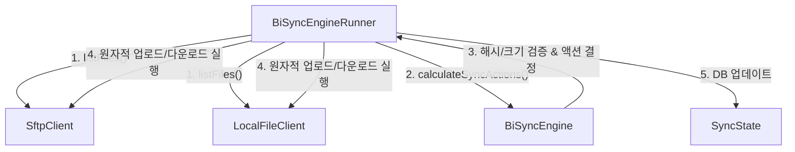

# ⚡ SFTP BiSync

> **Kotlin Multiplatform (KMP) & Compose Multiplatform**으로 개발된 스마트하고 스타일리시한 양방향 SFTP 동기화 클라이언트입니다. Android 모바일과 Desktop(Linux, Windows, macOS) 환경 모두에서 동일하게 강력한 동기화 성능을 제공합니다.

<p align="center">
  
  
  
  
</p>

---

## ✨ 핵심 기능 (Features)

### 🔄 1. 지능형 3-Way 양방향 동기화 (3-Way Synchronization)
단순한 파일 덮어쓰기나 1차원적 비교를 넘어, 가장 최근의 동기화 상태 스냅샷(`.sftp-sync-state.json`)을 추적하는 **3-Way 비교 알고리즘**을 사용합니다.
* **삭제 완벽 지원**: 한쪽에서 삭제된 파일이 다른 쪽에 다시 업로드되거나 다운로드되는 문제 없이, 삭제 상태를 감지하여 양쪽에 올바르게 전파합니다.
* **수정 감지**: 파일 생성, 수정, 삭제를 정확히 파악하여 오직 변경된 파일만 최소한의 네트워크 비용으로 동기화합니다.

### 🛡️ 2. 강력한 충돌 해결 정책 (Conflict Resolution)
동일한 파일이 로컬과 원격지에서 동시에 수정되었을 경우를 대비해 4가지 지능형 충돌 제어 전략을 제공합니다.
* 🕒 **최근 수정본 우선 (`NEWER_WINS`)**: 가장 마지막에 수정된 최신 타임스탬프 파일로 자동 덮어씁니다.
* 💻 **로컬 우선 (`LOCAL_WINS`)**: 충돌 시 항상 로컬 파일을 마스터로 삼아 원격지에 강제 덮어씁니다.
* ☁️ **원격 우선 (`REMOTE_WINS`)**: 충돌 시 원격지 파일을 마스터로 삼아 로컬에 강제 다운로드합니다.
* 📂 **양쪽 모두 보존 (`KEEP_BOTH`)**: 원본 파일을 유지하면서, 충돌된 파일명을 변경하여 두 버전을 모두 보존합니다.

### ⚙️ 3. 세밀한 동기화 조건 & 예외 규칙 (Sync Conditions & Filters)
* **다양한 변경 조건 설정**:
  * 타임스탬프 기준 (`TIME_DIFFERENT`)
  * 용량 기준 (`SIZE_DIFFERENT`)
  * 타임스탬프 및 용량 복합 기준 (`TIME_AND_SIZE_DIFFERENT`)
* **지능형 파일 제외 필터**: `.git`, `.DS_Store`, `Thumbs.db` 등 불필요한 빌드/시스템 메타데이터 파일뿐만 아니라 사용자가 직접 정의한 파일 및 와일드카드 확장자 규칙(`*.tmp`, `*.log` 등)을 제외할 수 있습니다.

### 🎨 4. Premium Dark-Mode UX (시각적 최적화)
* **Harmonious Color Palette**: `Slate900`, `Slate800` 기반의 품격 있는 다크 테마 위에 `CyanGlow`, `BlueGlow`, `VioletGlow`로 빛나는 세련된 그라데이션 및 네온 라이팅 효과를 적용했습니다.
* **다이내믹 마이크로 애니메이션**: 동기화 진행 상황에 따라 회전하는 동기화 링, 맥박이 뛰듯 부드럽게 흐르는 로딩 바, 실시간 동기화 상태를 알리는 글로우 인디케이터가 최고의 시각적 만족감을 선사합니다.
* **반응형 스플릿 레이아웃**: 데스크톱 환경에서는 좌측 사이드바와 우측 대시보드가 결합된 2-Pane 레이아웃으로, 모바일 환경에서는 1-Pane의 터치 친화적 레이아웃으로 자동 유연하게 변환됩니다.

---

## 🛠️ 시스템 아키텍처 (Architecture)

본 프로젝트는 단순한 파일 비교 전송 방식이 아닌, 전문적인 상태 기반 양방향 동기화 아키텍처를 따릅니다.

### 1. 4단계 동기화 수명 주기 (4-Stage Sync Lifecycle)
동기화는 다음과 같은 명확한 단계를 거쳐 안전하게 수행됩니다:
1. **스캔 (Scan)**: 로컬 파일 시스템 및 원격 SFTP 서버로부터 파일 목록(경로, 크기, 수정 시각)을 병렬로 수집합니다.
2. **비교 (Compare)**: 수집된 목록을 로컬 상태 DB에 기록된 마지막 성공 상태 스냅샷과 교차 비교합니다.
   * **SHA-256 해시 기반 검증**: 파일 수정 시간(mtime)의 신뢰성 문제를 보완하기 위해 파일 크기 및 SHA-256 해시를 기본 검증 수단으로 삼습니다. 변경이 없는 파일은 해시 계산을 건너뛰어 성능을 최적화합니다.
3. **해결 (Resolve)**: 충돌(`CONFLICT`) 감지 시 설정된 충돌 해결 정책(`NEWER_WINS`, `LOCAL_WINS`, `REMOTE_WINS`, `KEEP_BOTH`)을 적용합니다. 양쪽 내용이 실질적으로 동일하면(`localHash == remoteHash`) 충돌 대신 동기화 성공 상태로 자동 처리합니다.
4. **실행 (Execute)**: 검증된 동작에 따라 업로드, 다운로드, 삭제를 수행하고 최종 성공 시 로컬 상태 DB를 업데이트합니다.

### 2. 원자적 전송 (Atomic Write & Rename)
전송 중 네트워크 끊김이나 앱 강제 종료로 인한 파일 손상을 원천 차단하기 위해 원자적 쓰기 메커니즘을 지원합니다.
* **원격 업로드**: 먼저 원격지의 임시 경로(예: `파일명.tmp`)로 업로드 완료 후, SFTP의 `rename` 명령어를 사용하여 원본 대상 위치로 한 번에 교체합니다.
* **로컬 다운로드**: 로컬 임시 파일(예: `파일명.tmp`)로 다운로드 후 성공 시에만 기존 파일을 교체하는 원자적 파일 이동 연산을 수행합니다.

### 3. 컴포넌트 구조


### 📂 주요 디렉터리 구성
* `composeApp/src/commonMain` : 핵심 비즈니스 로직, 3-Way 동기화 엔진(`BiSyncEngine`), 그리고 멀티플랫폼 공통 UI 및 Viewmodel.
* `composeApp/src/androidMain` : Android 타겟 관련 권한 획득(Storage Access) 및 파일 입출력 브릿지 로직.
* `composeApp/src/desktopMain` : Desktop(Windows/Linux/macOS) 환경을 위한 시스템 연동 모듈.

---

## 🚀 시작 가이드 (Getting Started)

### 📋 사전 준비 사항
* **Java 17** 이상 설치 필요
* **Android SDK** (Android 빌드 시 필요)

### 🏃 빌드 및 실행 방법

#### 1. 데스크톱 앱 로컬 실행 (Desktop JVM)
```bash
./gradlew :composeApp:run
```

#### 2. Android 앱 로컬 설치 (Android Debug)
```bash
./gradlew :composeApp:installDebug
```

---

## 📦 올인원 빌드 및 패키징 스크립트 (`build_all.sh`)

프로젝트 루트에 포함된 `build_all.sh` (Windows의 경우 `build_all.bat`) 스크립트를 실행하면 터미널 진단 도구를 통해 설치된 패키징 도구를 감지하고, 한 번의 명령으로 모든 타겟의 최종 배포용 설치 패키지를 빌드합니다.

```bash
./build_all.sh
```

### 🎁 생성되는 빌드 결과물 (`build-outputs/` 하위)
스크립트 실행 완료 시 다음과 같이 각 플랫폼에 최적화된 설치 파일이 자동으로 패키징되어 한곳에 모입니다.

* 📱 **Android**: `build-outputs/android/SftpSync-debug.apk` (안드로이드 모바일 설치 파일)
* 🐧 **Linux (RPM)**: `build-outputs/linux/sftpsyncapp-*.x86_64.rpm` (RedHat, Fedora 등 패키지)
* 🐧 **Linux (DEB)**: `build-outputs/linux/sftpsyncapp_*_amd64.deb` (Debian, Ubuntu 등 패키지)
* 🪟 **Windows**: `build-outputs/windows/` 하위 `.msi` 및 `.exe` 설치 패키지 (WiX Toolset 필요, Windows 호스트에서 실행 시 빌드됨)

---

## 🔒 보안 정책 (Security First)
* **인증 자격 증명 암호화**: 동기화 프로필에 등록된 SFTP 비밀번호 및 개인 키(SSH Private Key)는 평문으로 노출되지 않고 안전하게 직렬화되어 각 운영체제별 로컬 샌드박스 설정 파일 내에 안전하게 격리됩니다.
* **통신 암호화**: 모든 데이터 전송은 SSH File Transfer Protocol(SFTP)을 사용하므로, 네트워크 전송 중 패킷 도청의 염려가 전혀 없는 강력한 엔드투엔드 암호화가 보장됩니다.

---
*개발 파트너와 함께하는 아름답고 매끄러운 양방향 동기화 라이프를 경험하세요! 🚀*
